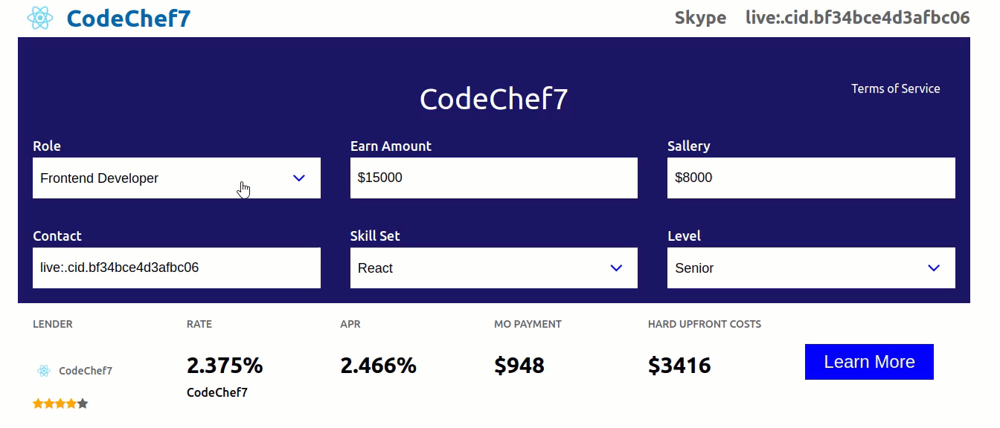

<h2>React Animation UI</h2>

<pre>
  * React, material-UI, Framer-motion
</pre>

<h3>:gear: Getting started</h3>

1. Clone project.
2. Install required dependencies with `yarn install`. 
3. Run project using `npm start` command
4. Deploy on github-pages using `yarn build` command.

<pre>
  Demo site ()
</pre>